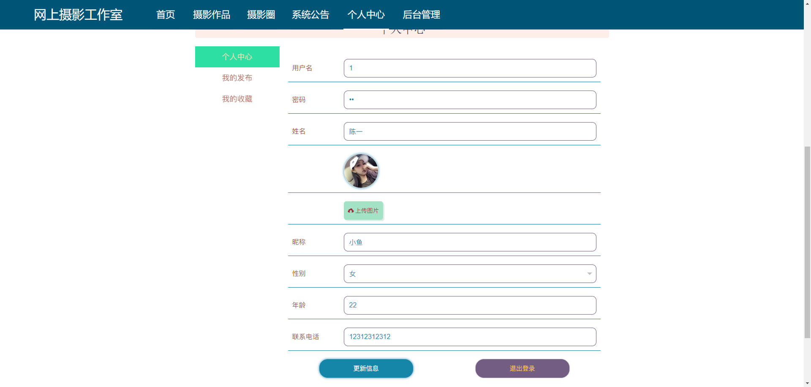

# 基于Springboot的网上摄影工作室

## Springboot-0098


## 技术栈

Springboot mybatisplus vue mysql maven


## 数据库表(10张)


## 功能介绍

```properties
网上摄影工作室管理员功能有个人中心，用户信息管理，作品分类管理，摄影作品管理，摄影圈，系统管理等。

用户可以注册登录，对摄影作品进行收藏和点赞以及评论，摄影圈发布信息，发布摄影作品，我的收藏等。
```


## 图片

### 前台


后台


## 访问路径

### 前台

```properties
http://localhost:8080/springboot07j52/front/pages/login/login.html

账号 1
密码 11
```

### 后台

```properties
http://localhost:8080/springboot07j52/admin/dist/index.html#/login

账号 abo
密码 aboo
```


## 功能图


## 文档目录


## 打赏或交流


